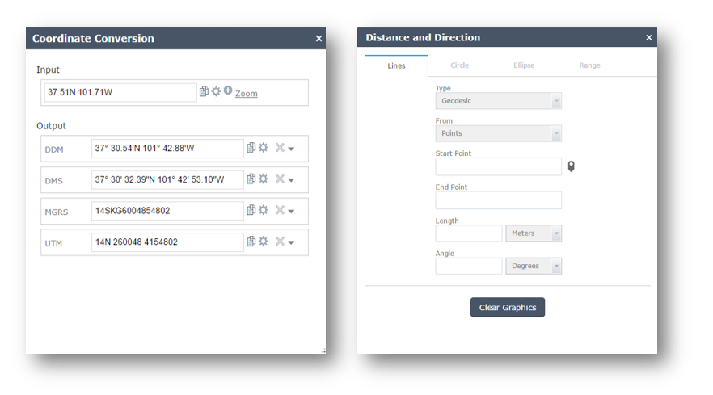

# military-tools-webappbuilder
The Web AppBuilder Widgets for Military Tools for ArcGIS is a set of widgets for use with the Web AppBuilder for ArcGIS. These widgets address specialized workflows for defense users. Additionally, these widgets are created and managed by the Esri Solutions teams. 

## Sections

* [Features](#features)
* [Requirements](#requirements)
* [Instructions](#instructions)
* [Resources](#resources)
* [Issues](#issues)
* [Contributing](#contributing)
* [Repository Points of Contact](#repository-points-of-contact)
* [Branching and Releases](#branching-and-releases)
* [Licensing](#licensing)

## Features
The Widget Repository currently includes:

* [Distance and Direction](./DistanceAndDirection/ReadMe.md)
* [Coordinate Conversion](./CoordinateConversion/ReadMe.md) 
* [Visibility](./Visibility/ReadMe.md) 

## Requirements
Requires Web AppBuilder for ArcGIS version 1.2 and above. 

## Instructions
Deploying Widgets.

To use the widgets with you should copy any of the widgets to the stemapp/widget directory. This is located in %webappbuilder_install%/client/stemapp/widget directory.

For more resources on developing modifying widgets please visit
[Web AppBuilder for ArcGIS Documentation](http://doc.arcgis.com/en/web-appbuilder/)

### General Help
[New to Github? Get started here.](http://htmlpreview.github.com/?https://github.com/Esri/esri.github.com/blob/master/help/esri-getting-to-know-github.html)

## Resources

* [Web AppBuilder API](https://developers.arcgis.com/web-appbuilder/api-reference/css-framework.htm)
* [ArcGIS API for JavaScript](https://developers.arcgis.com/javascript/)
* [ArcGIS Blog](http://blogs.esri.com/esri/arcgis/)
* [ArcGIS Solutions Website](http://solutions.arcgis.com/military/)
* [@EsriDefense](http://twitter.com/EsriDefense)

## Issues

* Find a bug or want to request a new feature?  Please let us know by submitting an issue.

## Contributing

Please see our [guidelines for contributing](http://github.com/Esri/solutions-webappbuilder-widgets/blob/master/CONTRIBUTING.md).

## Repository Points of Contact

#### Repository Owner: [Kevin](https://github.com/kgonzago)

* Merge Pull Requests
* Creates Releases and Tags
* Manages Milestones
* Manages and Assigns Issues

#### Secondary: [Lyle](https://github.com/topowright)

* Backup when the Owner is away

## Branching and Releases

#### Branches ####
New widgets and development should always be created in a separate branch from master. One or more widgets can be contained in a branch. A widget should only be merged with the Master branch if it has been tested is ready to be used with the current released version of Web App Builder and ready for release. 

#### Releases ####
Releases are created for the following reasons:
- A new version of Web App Builder has been released. 
- A widget (or set of widgets) has been released or updated on the solutions website

## Licensing

Copyright 2015 Esri

Licensed under the Apache License, Version 2.0 (the "License");
you may not use this file except in compliance with the License.
You may obtain a copy of the License at

   http://www.apache.org/licenses/LICENSE-2.0

Unless required by applicable law or agreed to in writing, software
distributed under the License is distributed on an "AS IS" BASIS,
WITHOUT WARRANTIES OR CONDITIONS OF ANY KIND, either express or implied.
See the License for the specific language governing permissions and
limitations under the License.

A copy of the license is available in the repository's
[license.txt](LICENSE.txt) file.

[ss_dd]: /DistanceAndDirection/images/screenshot.png
[ss_cc]: /CoordinateConversion/images/screenshot.png

